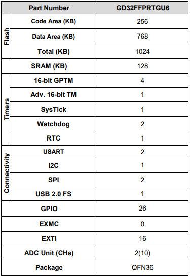

# [GD32FFPR](https://github.com/SoCXin/GD32FFPR)

#### [Vendor](https://github.com/SoCXin/Vendor)：[GigaDevice](https://www.gigadevice.com/)
#### [Core](https://github.com/SoCXin/Cortex)：[Cortex M4](https://github.com/SoCXin/M4)
#### [Level](https://github.com/SoCXin/Level)：168 MHz
## [GD32FFPR描述](https://github.com/SoCXin/GD32FFPR/wiki)

[GD32FFPR](https://github.com/SoCXin/GD32FFPR)

##### 关键特性

* 256K(Code) + 768K(DATA)
* USB 2.0
* 12bit ADC (2.6MSPS)
* RTC
* 封装(QFN36)

### [资源收录](https://github.com/SoCXin/GD32FFPR)

* [参考文档](docs/)
* [参考资源](src/)
* [参考工程](project/)

### [选型建议](https://github.com/SoCXin)

[GD32FFPR](https://github.com/SoCXin/GD32FFPR)

###  [SoC.芯](http://www.SoC.Xin)
